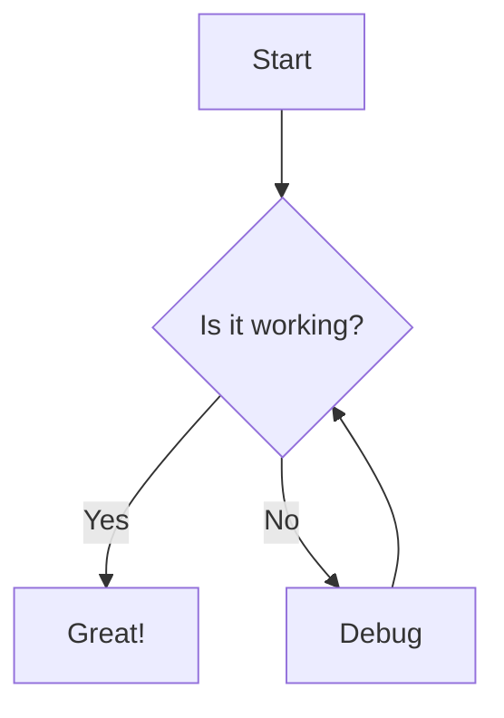
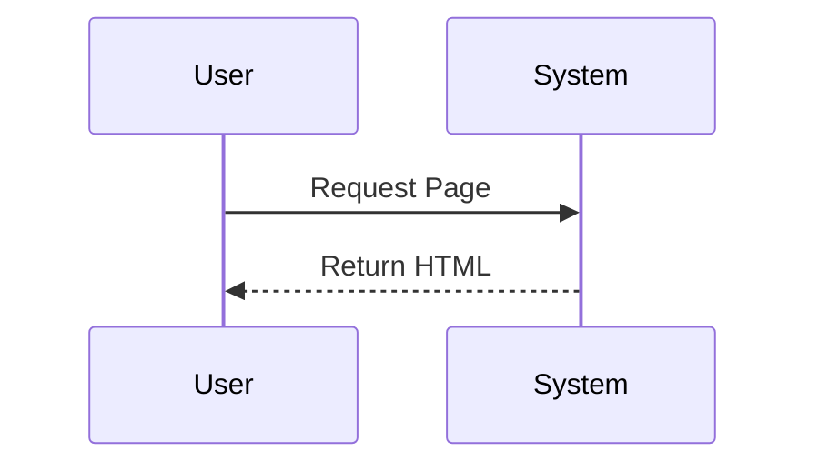

# Markdown Rendering Demo

This is a **demonstration** of the enhanced markdown rendering capabilities.

## 1. Typography & Basic Formatting

You can use *italics*, **bold**, `inline code`, and ~~strikethrough~~.

> This is a blockquote. It should look stylish now.
> 
> "Design is not just what it looks like and feels like. Design is how it works."

## 2. Lists & Checkboxes

*   [x] Markdown Rendering
*   [x] Syntax Highlighting
*   [x] Mermaid Diagrams
*   [ ] World Domination

1.  First item
2.  Second item
    *   Nested item

## 3. Code Blocks & Syntax Highlighting

```javascript
// This is a JavaScript code block
import React from 'react';

const App = () => {
  return (
    <div className="p-4 bg-gray-100 rounded-lg">
      <h1>Hello World</h1>
    </div>
  );
};
```

## 4. Mermaid Diagrams (Dynamic!)





## 5. Math Equations

Lift($L$) can be determined by Lift Coefficient ($C_L$) like the following equation.

$$
L = \frac{1}{2} \rho v^2 S C_L
$$

## 6. Tables

| Feature | Support | Status |
| :--- | :---: | ---: |
| Tables | Yes | ✅ |
| Alignment | Yes | ✅ |
| Styling | Yes | ✅ |

## 7. Images (Click to Zoom)


## 8. Spoilers (Hidden Text)

You can hide text using the spoiler syntax.

Inline spoiler: The killer is :spoiler[Keyser Söze]!

Block spoiler:
:::spoiler
This is a hidden block of text.
It reveals when you click on it.
:::
